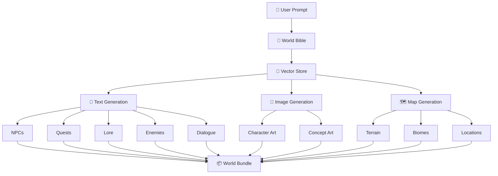

# Eldoria
# 🌍 Eldoria

### AI-Powered Procedural Worldbuilding Engine

> **Give Eldoria a seed of an idea. Watch it grow into a living world.**

Eldoria is an AI-powered worldbuilding system designed to transform a simple user prompt into a **cohesive, interconnected game world**.

Instead of generating isolated pieces of content, Eldoria maintains a persistent **World Bible** and uses **retrieval-augmented generation** to keep every generated element grounded in the same world.

From a single concept, Eldoria can generate:

* 📜 **World Lore**
* 🧙 **NPCs**
* ⚔️ **Quests**
* 👹 **Enemies**
* 💬 **Dialogue**
* 🎨 **Concept Art**
* 🗺️ **Procedural Maps**
* 🔗 **NPC Relationships & Questlines**
* 📦 **A unified World Bundle**

The goal is simple:

**Don't just generate content. Generate a world where the content belongs together.**

---

## ✨ The Idea

Traditional generative AI systems often create each piece of content independently.

Ask for a kingdom.

Then ask for an NPC.

Then ask for a quest.

Then ask for a map.

You may end up with:

> A frozen kingdom containing a desert-born NPC who somehow serves a sea god in a city that isn't even on the generated map.

Eldoria approaches the problem differently.

It establishes the rules, facts, tone, locations, characters, and relationships of the world first, then uses those canonical facts as context whenever new content is generated.

### 🧠 The Core Principle

```text
        One World
            ↓
     One Canonical Truth
            ↓
   Consistent Generation
            ↓
   Interconnected Content
```

Every generated element should feel like it came from the **same world**.

---

# 🏰 What is Eldoria?

Eldoria acts as a procedural worldbuilding layer between a user's imagination and a complete game-ready world.

A user might provide:

```text
Create a dark fantasy kingdom built around
a dying magical forest. The kingdom is ruled
by a paranoid king who believes the forest
contains an ancient god.
```

Eldoria can transform that seed into:

```text
                    USER PROMPT
                         │
                         ▼
                  ┌─────────────┐
                  │ WORLD BIBLE │
                  └──────┬──────┘
                         │
                         ▼
                  ┌─────────────┐
                  │ VECTOR STORE│
                  └──────┬──────┘
                         │
          ┌──────────────┼──────────────┐
          ▼              ▼              ▼
     TEXT ENGINE     IMAGE ENGINE    MAP ENGINE
          │              │              │
          ▼              ▼              ▼
      NPCs/Quests     Concept Art     World Map
      Lore/Dialogue
          │              │              │
          └──────────────┼──────────────┘
                         ▼
                  ┌─────────────┐
                  │ WORLD BUNDLE│
                  └─────────────┘
```

The result isn't just a collection of generated files.

It is a **connected world model**.

---

# 🧭 System Architecture


Eldoria is organized around four major layers:

### 1. 🌱 World Foundation

The user's prompt is transformed into a **World Bible**.

The World Bible stores canonical information such as:

* World history
* Geography
* Factions
* Cultures
* Important locations
* Characters
* Rules of the world
* Tone and atmosphere
* Major conflicts
* Existing relationships
* Narrative constraints

This becomes the foundation of the generated world.

---

### 2. 🧠 Context & Memory

The World Bible is connected to a **vector store**.

Relevant information is retrieved whenever a generator needs context.

Instead of asking the model:

```text
"Generate an NPC."
```

Eldoria can provide:

```text
Generate an NPC using:

• Current world lore
• Relevant faction information
• Nearby locations
• Existing characters
• Current conflicts
• Existing quests
• World tone
• Relevant historical events
```

This helps reduce contradictions and keeps generated content connected.

---

### 3. ⚙️ Generation Layer

The retrieved world context feeds multiple specialized generators.

#### 📜 Text Generators

Responsible for generating:

* Lore
* NPCs
* Quests
* Enemies
* Dialogue
* Relationships
* Narrative events

#### 🎨 Image Generator

Produces visual representations such as:

* Character concepts
* NPC portraits
* Environment concepts
* Creature concepts
* Other world artwork

#### 🗺️ Map Generator

Creates procedural maps using world information such as:

* Biomes
* Terrain
* Regions
* Locations
* Environmental constraints

---

### 4. 📦 World Bundle

All generated information is brought together into a structured **World Bundle**.

The bundle acts as the common output format between the different parts of Eldoria.

Conceptually:

```text
World Bundle
│
├── World
│   ├── Name
│   ├── Description
│   ├── History
│   └── Rules
│
├── Regions
│   ├── Biomes
│   ├── Locations
│   └── Map Data
│
├── Characters
│   ├── NPCs
│   ├── Enemies
│   └── Relationships
│
├── Quests
│   ├── Main Quests
│   ├── Side Quests
│   └── NPC Questlines
│
├── Lore
│   ├── Factions
│   ├── Legends
│   └── Historical Events
│
├── Dialogue
│
└── Visual Assets
    ├── Character Art
    └── Concept Art
```

---

# 🔮 The Eldoria Pipeline

The complete generation process can be represented as:



---

# 🧬 Why the World Bible Matters

The World Bible is the **canonical source of truth** for Eldoria.

Without it, individual generators may behave like isolated storytellers.

With it, they become parts of the same narrative system.

For example:

```text
World Bible
     │
     ├── Kingdom: Asterra
     │
     ├── Capital: Valen
     │
     ├── Faction: The Ashen Order
     │
     ├── Ancient Event: The Sundering
     │
     └── Threat: The Hollow King
              │
              ▼
          NPC Generator
              │
              ▼
        Commander Elric
              │
              ▼
          Quest Generator
              │
              ▼
       "Ashes of Valen"
              │
              ▼
        Map Generator
              │
              ▼
       Ruins of Valen
```

The generated pieces now have **relationships**.

That's the heart of Eldoria.

---

# 🧠 Retrieval-Augmented Generation

Eldoria uses retrieval to provide generators with relevant information from the existing world.

Conceptually:

```text
                WORLD BIBLE
                     │
                     ▼
              ┌─────────────┐
              │  Embeddings │
              └──────┬──────┘
                     ▼
              ┌─────────────┐
              │ Vector Store│
              └──────┬──────┘
                     │
             User Generation Request
                     │
                     ▼
              Relevant Context
                     │
                     ▼
               LLM Generator
                     │
                     ▼
              New World Element
                     │
                     ▼
              Update World State
```

This creates a feedback loop where the world can gradually become richer while maintaining continuity.

---

# ⚔️ Example Generation

Imagine the user enters:

```text
Create a grim medieval kingdom surrounded by
an enormous corrupted forest. The kingdom's
ruler is slowly losing his mind.
```

Eldoria can build:

### 🌍 World

**Kingdom of Veyr**

A declining kingdom surrounded by the Blackroot Forest.

### 👑 Ruler

**King Aldric IV**

A paranoid monarch convinced that the forest is communicating with him.

### 🧙 NPC

**Ser Kaelen**

A royal knight investigating disappearances along the forest border.

### ⚔️ Quest

**The Whispering Roots**

Kaelen asks the player to investigate a ruined watchtower where soldiers have disappeared.

### 👹 Enemy

**Rootbound Knight**

A former royal soldier corrupted by the forest.

### 🗺️ Location

**Blackroot Watchtower**

A ruined fortress positioned on the northern edge of the forest.

### 💬 Dialogue

Kaelen's dialogue references:

* The Blackroot Forest
* King Aldric
* Missing soldiers
* The ruined watchtower
* The growing corruption

### 🎨 Concept Art

The image generator produces visual concepts for:

* Kaelen
* The Rootbound Knight
* Blackroot Watchtower

### 🗺️ Map

The map generator places:

```text
                 BLACKROOT FOREST
              ███████████████████
              ███████     ███████
                   │
             Watchtower
                   │
                   │
              Kingdom Road
                   │
                   ▼
                VALEN
              ┌────────┐
              │ CASTLE │
              └────────┘
```

Everything belongs to the same world.

---

# 🏗️ Project Structure

```text
eldoria/
│
├── backend/
│   │
│   ├── core/
│   │   ├── llm.py
│   │   ├── world_bible.py
│   │   └── rag.py
│   │
│   ├── generators/
│   │   ├── npcs.py
│   │   ├── quests.py
│   │   ├── enemies.py
│   │   ├── lore.py
│   │   ├── dialogue.py
│   │   ├── images.py
│   │   └── maps.py
│   │
│   ├── main.py
│   └── requirements.txt
│
├── frontend/
│
├── schema/
│   └── world_bundle.json
│
├── docs/
│   └── architecture.png
│
├── .env.example
├── .gitignore
└── README.md
```

---

# 🧩 Core Components

## `backend/core/llm.py`

Centralized interface for interacting with the language model.

Responsibilities include:

* Model communication
* Prompt handling
* Shared configuration
* Retry logic
* Error handling
* Response processing

Keeping this logic centralized prevents every generator from implementing its own model client.

---

## `backend/core/world_bible.py`

Responsible for the canonical world state.

Potential responsibilities:

* Creating world foundations
* Updating world information
* Reading canonical facts
* Managing world metadata
* Maintaining narrative consistency

---

## `backend/core/rag.py`

Responsible for retrieval and vector-store interaction.

Potential responsibilities:

* Embedding generation
* Document indexing
* Similarity search
* Context retrieval
* Relevant world-state injection

---

# ⚙️ Generators

Each generator focuses on one type of world content.

| Generator     | Responsibility            |
| ------------- | ------------------------- |
| `npcs.py`     | NPC generation            |
| `quests.py`   | Quest generation          |
| `enemies.py`  | Enemy generation          |
| `lore.py`     | Lore and history          |
| `dialogue.py` | Character dialogue        |
| `images.py`   | Visual generation         |
| `maps.py`     | Procedural map generation |

This modular design allows individual generators to evolve independently.

---

# 📦 World Bundle

The World Bundle is the structured representation of the generated world.

It provides a common contract between:

```text
Backend
   ↕
Generators
   ↕
Frontend
   ↕
Generated World
```

The schema lives in:

```text
schema/world_bundle.json
```

This makes the output predictable and easier to consume by other applications.

---

# 🎯 Design Goals

Eldoria is being designed around several principles.

### 1. Consistency

Generated content should respect established world facts.

### 2. Modularity

Each generator should be independently replaceable or extendable.

### 3. Interconnectedness

NPCs should connect to factions.

Quests should connect to NPCs.

Locations should connect to quests.

Lore should explain the world.

Maps should reflect the generated geography.

### 4. Extensibility

New generators should be easy to add.

For example:

```text
Generators
│
├── NPC
├── Quest
├── Lore
├── Enemy
├── Dialogue
├── Image
├── Map
│
├── Items          ← Future
├── Weapons        ← Future
├── Factions       ← Future
├── Religion       ← Future
└── Economy        ← Future
```

### 5. Structured Output

The final world should be machine-readable rather than existing only as generated text.

---

# 🚀 Future Possibilities

Eldoria can eventually grow beyond basic world generation.

Potential extensions include:

* 🏰 Faction simulation
* 💰 Dynamic economies
* ⚔️ Enemy AI generation
* 🧑‍🤝‍🧑 NPC relationship graphs
* 🗡️ Weapon and item generation
* 📜 Dynamic quest progression
* 🎭 Personality-driven NPC dialogue
* 🌦️ Dynamic weather systems
* 🗺️ Multi-region world generation
* 🏛️ Civilization generation
* 🕰️ Historical timeline generation
* 📈 World-state evolution
* 🎮 Game-engine integration
* 🔄 Persistent worlds that evolve over time

The long-term vision is to move from:

```text
Generate a world
```

toward:

```text
Generate a world
        ↓
Populate it
        ↓
Simulate it
        ↓
Let characters react to it
        ↓
Let quests evolve
        ↓
Let the world change
        ↓
Create a living narrative system
```

---

# 🛠️ Development Philosophy

Eldoria follows a modular architecture so that individual components can be developed and tested independently.

Development is organized around feature branches:

```text
main
│
├── backend
├── generators
├── frontend
└── schema
```

Each contributor works on their assigned branch before changes are integrated into `main`.

Recommended workflow:

```text
Create / checkout branch
        ↓
Implement feature
        ↓
Test locally
        ↓
Commit changes
        ↓
Push branch
        ↓
Open Pull Request
        ↓
Code Review
        ↓
Merge into main
```

This keeps `main` stable while allowing multiple components of Eldoria to evolve simultaneously.

---

# 👥 Collaboration

Eldoria is designed as a collaborative project.

Suggested ownership:

| Area                | Branch       |
| ------------------- | ------------ |
| Backend Core        | `backend`    |
| Content Generators  | `generators` |
| Frontend            | `frontend`   |
| World Bundle Schema | `schema`     |

Contributors should avoid making unrelated changes outside their assigned area unless coordinated with the rest of the team.

---

# 🔐 Environment Configuration

Environment variables should be stored locally and **never committed to the repository**.

Use:

```text
.env.example
```

as a template for required configuration.

The actual `.env` file should remain local and be excluded through `.gitignore`.

---

# 🧪 Testing Strategy

As Eldoria grows, testing should happen at multiple levels.

### Unit Tests

Test individual components:

```text
RAG
World Bible
NPC Generator
Quest Generator
Map Generator
```

### Integration Tests

Verify that components work together:

```text
World Bible
     ↓
RAG
     ↓
Generator
     ↓
World Bundle
```

### Consistency Tests

Verify that generated content does not violate established world facts.

For example:

```text
World Bible:
Kingdom = Veyr

Generated NPC:
Kingdom = Veyr       ✅

Generated NPC:
Kingdom = Solmara    ❌
```

This type of validation is especially important for Eldoria.

---

# 📊 The Bigger Picture

Eldoria sits at the intersection of:

```text
             ┌──────────────────┐
             │  Generative AI   │
             └────────┬─────────┘
                      │
                      ▼
        ┌───────────────────────────┐
        │      WORLD GENERATION     │
        └───────────────────────────┘
             ▲       ▲       ▲
             │       │       │
          RAG      Procedural  Structured
                   Generation   Data
             │       │       │
             ▼       ▼       ▼
          ┌──────────────────────┐
          │      ELDORIA         │
          └──────────────────────┘
                    │
                    ▼
             🎮 Game Development
```

It combines **generative AI, retrieval, procedural generation, structured data, and game-world design** into a single pipeline.

---

# 🌌 Vision

Most generators answer:

> **"What should I generate?"**

Eldoria aims to answer a more interesting question:

> **"What belongs in this world?"**

That distinction is the foundation of the project.

A world is not merely:

```text
Lore + NPCs + Quests + Maps
```

A world is:

```text
Lore
  ↕
History
  ↕
Factions
  ↕
Characters
  ↕
Relationships
  ↕
Quests
  ↕
Locations
  ↕
Geography
  ↕
Events
```

Eldoria's purpose is to turn those relationships into a structured, generative system.

---

# 🗺️ Roadmap

### Phase I • Foundation

* [x] Repository architecture
* [x] Backend structure
* [x] Generator modules
* [x] World Bundle schema
* [ ] LLM integration
* [ ] World Bible implementation
* [ ] Vector store integration

### Phase II • Generation

* [ ] Lore generation
* [ ] NPC generation
* [ ] Quest generation
* [ ] Enemy generation
* [ ] Dialogue generation
* [ ] Image generation
* [ ] Map generation

### Phase III • Integration

* [ ] Connect generators to World Bible
* [ ] Implement retrieval pipeline
* [ ] Generate unified World Bundles
* [ ] Add consistency validation
* [ ] Connect frontend to backend

### Phase IV • Living World

* [ ] NPC relationships
* [ ] Dynamic questlines
* [ ] Faction systems
* [ ] World-state updates
* [ ] Persistent world memory
* [ ] Event-driven world evolution

---

# 🧙 Eldoria in One Sentence

> **Eldoria is an AI-powered worldbuilding engine that transforms a single idea into a coherent, interconnected, and visually rich game world.**

---

## ⭐ Project Status

**🚧 Active Development**

Eldoria is currently under active development, with the architecture being built around modular generation, persistent world context, retrieval, and structured world output.

More features will be added as the system evolves.

---

## 📜 License

License information will be added as the project progresses.

---

<p align="center">

### 🌍 Build the world.

### 📜 Write its history.

### 🧙 Populate its legends.

### ⚔️ Give its people something worth fighting for.

**Welcome to Eldoria.**

</p>
